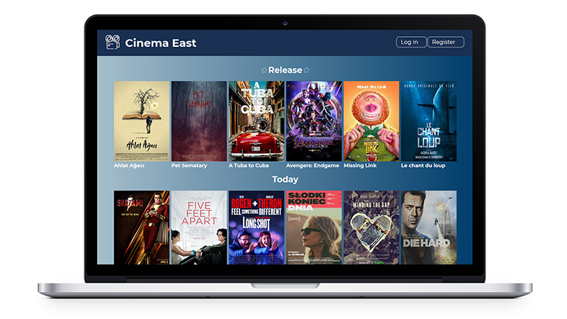
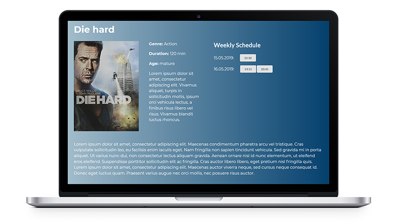
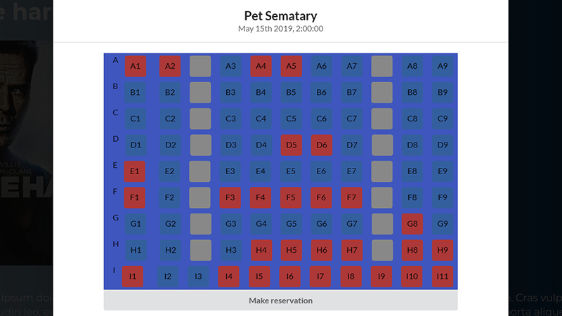
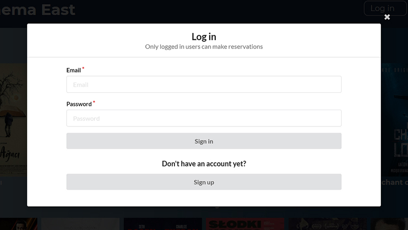

# CC3 Movie Reservation App
Simple web app made in React.js that simulates reservation system in a cinema. The project was done during Coders Camp course.

**[Check out live demo here!](https://peaceful-stream-96686.herokuapp.com/)**

## Table of contents
- [CC3 Movie Reservation App](#cc3-movie-reservation-app)
  - [Table of contents](#table-of-contents)
  - [General info](#general-info)
  - [Technologies](#technologies)
  - [Setup](#setup)
  - [Features](#features)
  - [Screenshots](#screenshots)
  - [Authors](#authors)

## General info

**Frontend:**
Client side of the app was made in React.js, using Create-React-App. It shows currently played movies, new releases, details of selected movie and available screenings. Logged-in user is able to reserve tickets for a movie by selecting seats on displayed layout of the room. App allows also registration of new users.

**Backend:**
The database is hosted in a cloud - MongoDB Atlas. It stores list of movies, details of each movie, schedules, screenings, rooms layouts with free and reserved seats, users of the app and their reservations.
We used Express.js to create a sever and manage GET, POST, PUT, DELETE HTTP requests on movies, screenings and reservations.
User authentication is handled with bcrypt and jsonwebtoken libraries. There is a possibility of registering new users. User gets a cookie storing their JSON web token while they log in. The cookie is removed from the browser when user logs out. Display of movies, movie details and schedule are accessible for all users. Ticket reservation is protected with user authentication and is accessible only for logged in users

## Technologies
* React.js
* JavaScript
* CSS
* HTML
* Webpack
* Node.js
* Express.js
* MongoDB/mongoose
* Heroku
* JSON Web Token
* bcrypt.js

## Setup
The project requires Node.js installed.

```bash
npm install
cd server
node server.js
```
To run the app:
```bash
cd client
npm start
```

## Features
* Authentication
* Registration of new users
* Display of currently played movies and new releases
* Display of details of selected movie
* Display of screenings schedule for selected movie
* Ticket reservation by selecting seats on a room layout


## Screenshots







## Authors
* https://github.com/KamilaCoder
* https://github.com/Aaspyr
* https://github.com/maciejkorolik
* https://github.com/MarcinCzajka
